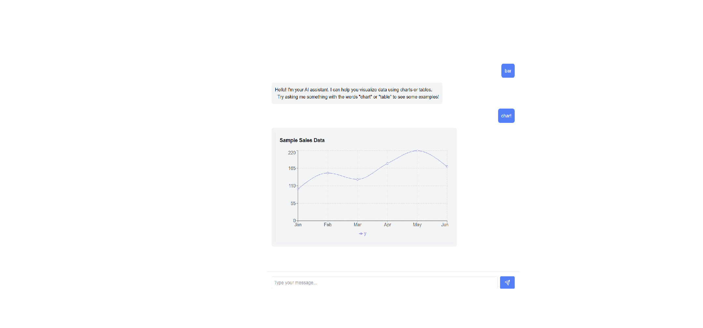
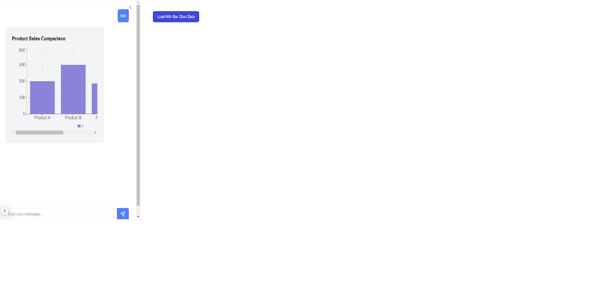

## AI ChatBot Customization

This is a simple App built with NextJs to demonstrate how we can customize a chat bot for following use cases:

- Custom Render - In most cases we want the bot to render custom components for some use cases, like visualization, custom layout or custom styles.
- Dynamic Context - We also want to re-use the same chat bot but with some custom context from the FE, so that we can enhance the knowledge base of the LLM.

I have not hooked the BE to LLM, this repo just shows how we can customize and pass data to the BE from the same re-useable bot and shows it in 2 different scenarios. In future I might update it to show more use cases.

## How Its done

### Custom Render

- To start with I have created a simple Bot component with the following configuration:
  ```ts
  type AIConfig = {
    context: string;
    systemPrompt: string;
    components: Record<string, React.ComponentType<any>>;
    renderRules: Array<{
      pattern: RegExp;
      component: string;
    }>;
    dynamicContextId?: string;
  };
  ```
- The `components` and the `renderRules` are the key items that allow us to customize what gets render inside the chatbot.
- We let the user add custom components with the custom rendering rules dictating what component to render when.

```ts
// Custom components for special rendering
const components = {
  Chart: Chart,
  Table: Table,
};

// Rules for when to use custom components
const renderRules = [
  {
    pattern: /^\/chart/,
    component: "Chart",
  },
  {
    pattern: /^\/table/,
    component: "Table",
  },
];

// this is how we invoke the chat bot
<ConfigurableAIChat
  context="You are a helpful AI assistant."
  systemPrompt={systemPrompt}
  components={components}
  renderRules={renderRules}
/>;
```

- Then in the `ConfigurableAIChat`, we have a `MessageRenderer` that handles the rules:

```ts
// Custom message renderer that handles special components
const MessageRenderer = ({
  content,
  components,
  renderRules,
}: { content: Record<string, any> | string } & Partial<AIConfig>) => {
  if (typeof content === "object") {
    // Check content against render rules
    for (const rule of renderRules!) {
      console.log(content.responseType, rule.component.toLowerCase());
      if (content.responseType === rule.component.toLowerCase()) {
        const Component = components![rule.component];
        if (Component) {
          return <Component content={content} />;
        }
      }
    }
    // Default text rendering
    return <div className="whitespace-pre-wrap">{content.data}</div>;
  }

  // Default text rendering for user type
  return <div className="whitespace-pre-wrap">{content}</div>;
};
```

### Dynamic Context

- For the context I have setup a context provider that let's user add dynamic and static context.
- The dynamic context, at the moment is just an array of ContextData, but could be improved to be an Object.

```ts
export const ContextProvider = ({
  children,
  initialContext = [],
}: {
  children: React.ReactNode;
  initialContext: ContextData[];
}) => {
  const [staticContext] = useState<ContextData[]>(initialContext);
  const [dynamicContext, setDynamicContext] = useState<ContextData[]>([]);

  const addDynamicContext = useCallback((context: ContextData) => {
    setDynamicContext((prev) => [...prev, context]);
  }, []);

  const removeDynamicContext = useCallback((id: string) => {
    setDynamicContext((prev) => prev.filter((ctx) => ctx.id !== id));
  }, []);

  return (
    <ChatContext.Provider
      value={{
        staticContext,
        dynamicContext,
        addDynamicContext,
        removeDynamicContext,
      }}
    >
      {children}
    </ChatContext.Provider>
  );
};
```

- We need to pass an extra prop to the chat component, that is the key for the dynamic data.

```ts
<ConfigurableAIChat
  ...
  dynamicContextId="barChartData"
/>
```

- Now anywhere where we want to open the chat with dynamic data we can, simply use the `addDynamicData` function.

```ts
const { addDynamicContext } = useContextData();

addDynamicContext({
  id: "barChartData", // this is dynamicContextId
  type: "custom",
  content: {
    responseType: "chart",
    type: "bar",
    data: [
      { x: "Product A", y: 300 },
      { x: "Product B", y: 450 },
      { x: "Product C", y: 280 },
      { x: "Product D", y: 390 },
    ],
    title: "Product Sales Comparison",
  },
});
```

- And in the `useChat` hook before sending the API call we grab and parse the dynamic data.

```ts
let dyContext: (typeof dynamicContext)[number] | string = "";
if (config.dynamicContextId) {
  dyContext =
    dynamicContext.find((ctx) => ctx.id === config.dynamicContextId) || "";
}

dyContext = JSON.stringify(dyContext);
// Prepare request
const chatRequest: ChatRequest = {
  messages: [...messages, userMessage],
  staticContext: config.context,
  dynamicContext: dyContext,
  systemPrompt: config.systemPrompt,
};
```

- The logic for parsing it in BE is in [routes]('./src/app/api/chat/route.ts)

## Local development

First, run the development server:

```bash
nvn use
npm install
npm run dev

```

## UI



